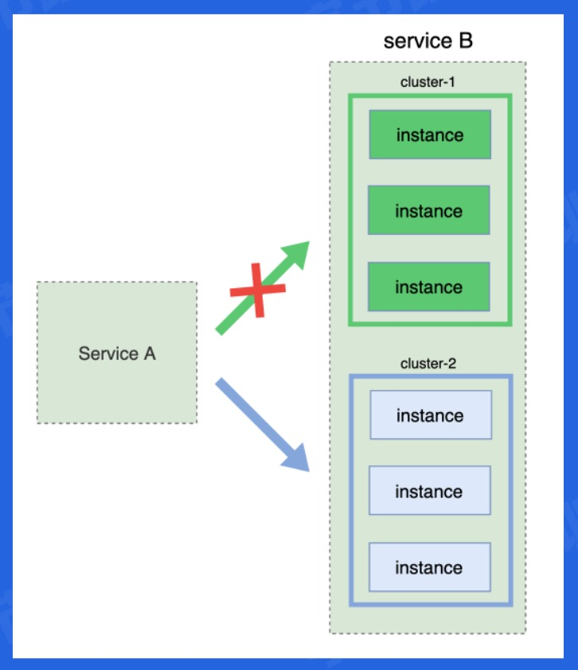
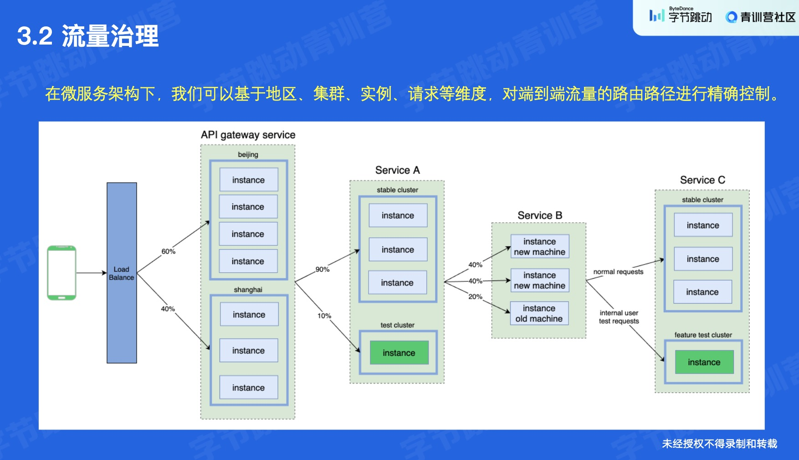
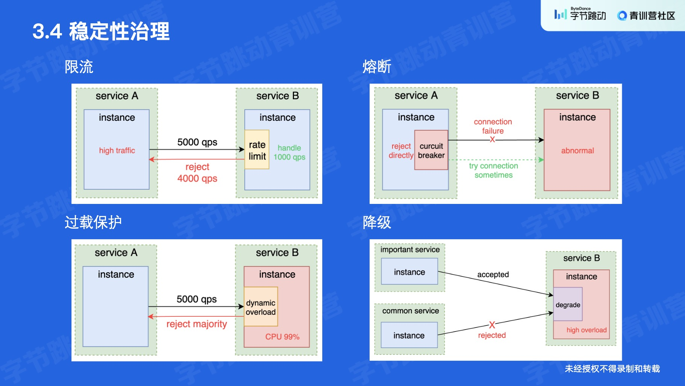

# 服务治理

[toc]

## 再探架构


### 单体架构

单进程开发


### 垂直架构

分部门开发，对部门来说仍然是单体架构


### 分布式架构

抽出公共模块，但这对公共模块的可用性提出了高要求


### soa 架构

服务是一等公民，多了一个服务注册中心，因此是中心化的架构设计


### 微服务架构

去中心化，但是要避免过微、观测等问题，因此需要服务治理


更详细的看微服务架构

- 网关负责处理流量
- 具体的服务提供能力
- 中台负责基础服务，如治理、日志等


微服务架构的核心问题


## 服务治理

### 问题引入

先看一个问题，在代码层面，如何调用一个目标服务的地址 `(ip:port)`

#### 硬编码

考虑如下 `hardcode` 方式

```go
cli := grpc.NewClient("10.23.45.67:8080")
```

这显然是不行的，因为
- `ip` 可能是动态变化的，一旦变化需要处处修改
- 分布式场景，有多个实例，`ip` 地址都不一样，上述写法只能将流量打到一个实例


#### DNS

可以解决之前的问题
- 一个域名可能对应多个 `ip`
- 域名类似于变量，比 `hardcode` 更具有普遍性

但有新的问题

- `DNS` 缓存带来的延时
- 负载均衡不“均衡”（伪随机算法的局限性）
- 不支持探活检查（不 `work` 的 `ip` 也可以绑定 `dns`）
- 域名无法配置端口（端口仍然是 `hardcode`）


#### 服务注册中心

加一层服务注册中心，本质上是一个 `name` 到 `ip:port` 的 `mapping`


### 服务注册

服务注册就是给 `map` 插入映射

### 服务发现

服务发现就是去 `map` 查询实例

### 上线和下线

修改服务注册中心记录即可。因为服务会不断进行服务发现，服务注册中心的更改都能被其感知。

### 服务发布

#### 挑战

线上服务不能随意停止，因此服务发布面临如下挑战


#### 蓝绿部署

一个集群先断掉，进行升级，升级完再把另一个断掉，进行升级



#### 金丝雀部署

我理解像是小流量试行，将所有实例逐步尝试升级到最新


## 流量治理

### 特征

负载均衡导流，网关限流、处理鉴权等，内部服务进行 `rpc` 调用，外部开放走 `http` 调用。

`rpc` 比 `http` 快，因为前者是二进制协议，后者是文本协议，前者牺牲了传输数据的可读性，换来了更高的编解码效率。


### 治理



## 稳定性治理

四个手段

- 限流（限制一部分请求）
- 熔断（直接拒绝请求）
- 过载保护（一个指标是 `cpu` 使用率）
- 降级（先拒绝内部请求）

