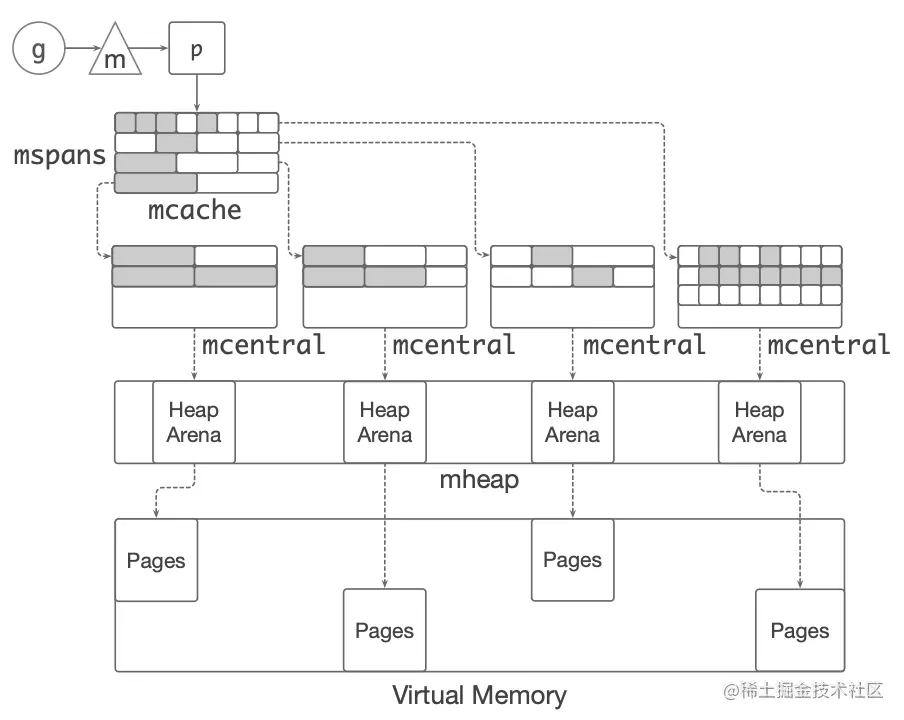

# homework

1. 从业务层和语言运行时层进行优化分别有什么特点？

- 业务层针对**具体场景**做优化，收益较大
- 运行时针对**通用场景**做优化，需要 trade-off

2. 从软件工程的角度出发，为了保证语言 SDK 的可维护性和可拓展性，在进行运行时优化时需要注意什么？

- 测试驱动，多测试，测试覆盖率要广泛
- 清晰的文档，告诉用户做了什么优化，没做什么，能有什么效果
- 隔离性，设置开关，允许用户选择性使用
- 可观测、可回滚、可灰度

3. 自动内存管理技术从大类上分为哪两种，每一种技术的特点以及优缺点有哪些？

- 追踪式垃圾回收(tracing GC)。
  - 特点：从根对象（全局、栈、静态）开始，通过扫描代码里的引用关系，追踪所有对象，从而维护一个引用关系的有向图，通过删除孤点完成 GC。
  - 优点 1：实现简单。
  - 缺点 1：GC 期间要挂起应用 (stop the world, stw)，因为要做代码扫描（识别根对象和引用关系，构件引用链）。
  - 缺点 2：由于 GC 和应用程序的不同步，始终存在垃圾内存（GC 扫描后删除）。
  - 应用：java，golang
- 引用计数垃圾回收(reference counting)。
  - 特点：开辟内存时，为每个对象额外开辟一个空间，存放计数器。
  - 优点 1：不需要挂起应用程序，GC 和程序可以交替进行。
  - 优点 2：GC 和应用程序同步，计数器置零后可以立即删除。
  - 缺点 1：考虑到多线程访问，计数器要用原子变量，因此运行时间开销大。
  - 缺点 2：每个对象都引入了额外的空间存储引用计数，内存开销大。
  - 缺点 3：环形引用比较棘手。
  - 应用：python，smart pointer。

4. 什么是分代假说？分代 GC 的初衷是为了解决什么样的问题？

- 根据代数划分对象，同时对堆空间划分区域。直到老对象的堆空间被占满，否则不会 GC 老对象。根据新老对象的不同，执行不同的 GC 算法。
- 基础算法频繁的搜索堆空间，因此搜索的堆空间大小直接影响了 GC 时间。

5. Go 是如何管理和组织内存的？

- 多级缓存，避免频繁的向 OS 申请内存
- mcentral 里有多个 mcache，mcache 里有多个 mspan，每个 mspan 以固定尺寸分块，给变量分配内存时选取最靠近的尺寸



6. 为什么采用 bump-pointer 的方式分配内存会很快？

- 只涉及到指针的移动

7. 为什么我们需要在编译器优化中进行静态代码分析？

- 静态分析指的是对程序运行逻辑的推导（例如展开分支）
- 静态分析帮助获取程序的**性质**，利用这个性质做优化
- 考虑如下程序，静态分析出该函数一定返回 ```c * 2```，因此代码段直接被优化为 ```return c * 2```

```cpp
int c = 10;
if (c > 5) {
    c *= 2;
}
return c;
```

8. 函数内联是什么，这项优化的优缺点是什么？

- 函数 inline: 将函数体直接在调用处展开，避免了函数压栈，同时对参数类型做检查（这是与 `#define` 区分的一点）
- 优点 1: 避免了函数压栈，消除调用开销，优化了程序运行效率
- 优点 2: 将过程间分析转换为过程内分析，帮助其他分析（例如逃逸分析）
- 缺点：代码段增大，编译出的文件体积增大，编译时间增加

9. 什么是逃逸分析？逃逸分析是如何提升代码性能的？

- 逃逸分析：分析指针变量的作用域
- 分析策略：本质上是分类讨论，指针可能逃逸到全局变量、静态变量、作为参数传递给其它函数
- 优化：未逃逸出去的指针可以直接栈变量分配，栈变量分配比堆分配更快（移动 sp 指针），同时降低 GC 压力