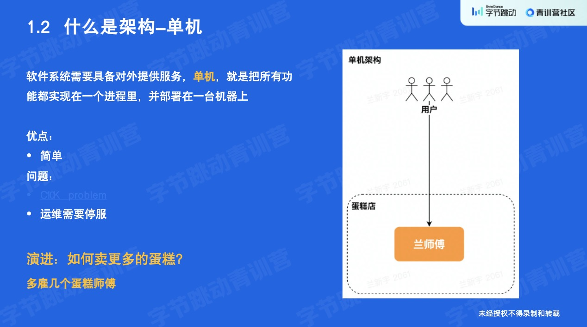
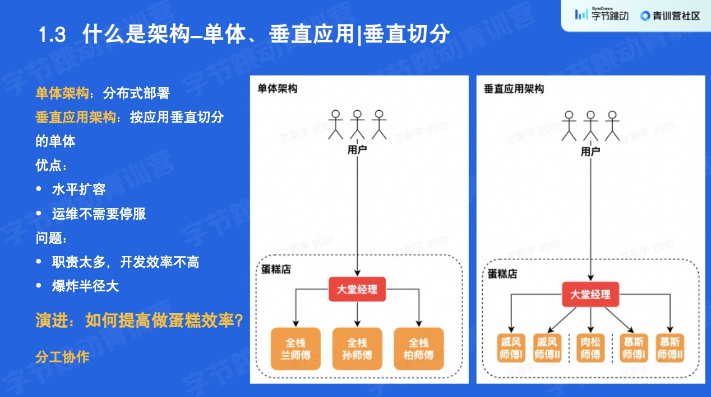
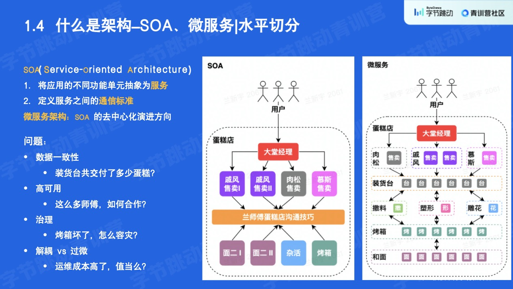
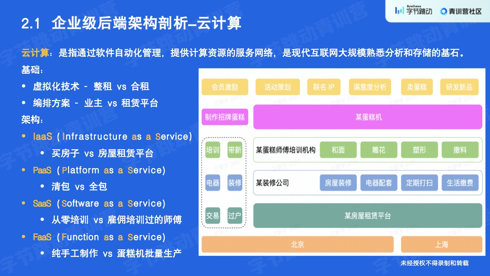

# 后端架构

[toc]

---

## 什么是架构

以蛋糕店为例，将出售的蛋糕比作我们提供的服务，来看看架构是如何体现，如何演进的。

### 单机架构

> 老板自己做、自己卖。

所有的功能都实现在一个**进程**，并部署在一台机器上，同一时间段只有一个进程的实例。

> 老板可能会尿急，顾客会排队，老板压力过大。

服务宕机，请求堆积，机器压力负载大。

### 单体架构

> 多雇佣几个蛋糕师傅，并雇佣大堂经理负责分配任务。

水平扩容，分布式部署进程，并配置负载均衡。

> 拆分蛋糕师傅的能力。

将进程垂直拆分成**应用**。

> 蛋糕师傅职责太多，一旦某个环节出错，整个链路爆炸。

应用职责粒度较粗，一旦出错会影响整个链路。

### 服务架构

> 细化蛋糕师傅权限，拆分成做、烤、卖...

应用拆成服务。

### 小结

架构的演进初衷

- 需求越来越多，终归要增加人手（多机部署）
- 越做越复杂，终究要分工合作（拆分解耦）

架构的演进思路

- 垂直切分（服务拆分）
- 水平切分（多机部署）

## 企业级后端案例分析

### 云计算

> IaaS 自己租店铺，还是找租赁公司帮忙租店铺。

自己买物理机器，还是由厂商提供。

> PaaS 自己装修店铺，还是找装修公司装修店铺。

自己搭环境，还是找厂商搭好的环境。

> SaaS 自己培训工人，还是找蛋糕培训机构出来的工人。

自己写软件，还是直接用已有的软件。

> FaaS 自己做蛋糕，还是用蛋糕机做蛋糕。

自己写服务，还是用已有的服务。

