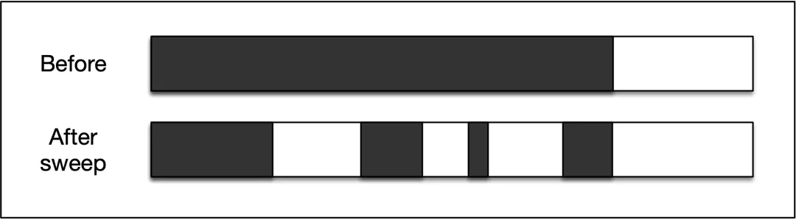
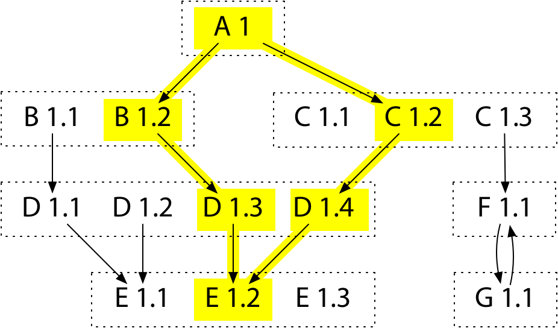
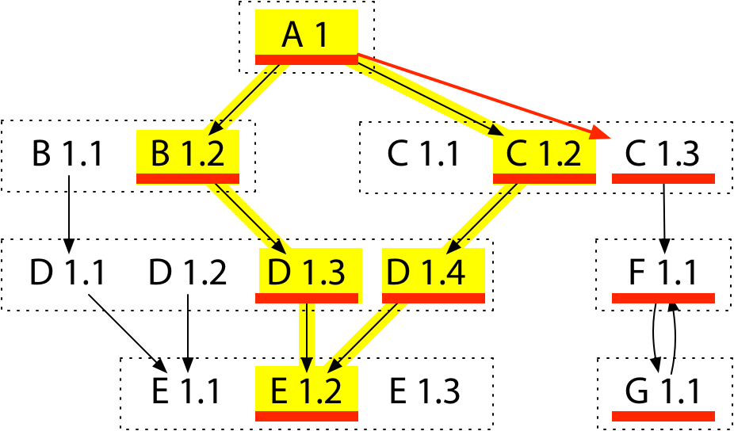

# go 基础知识

[toc]

## 并发

go 提倡用通信来完成内存的共享，而不是通过共享内存完成通信。

---

两个例子入门 go routine

```go
// example 1
func MutexConcurrency() int {
    var ans int
    var mt sync.Mutex
    var wg sync.WaitGroup 
    wg.Add(5)
    for i := 0; i < 5; i++ {
        go func() {
            defer wg.Done()
            for i := 0; i < 1000; i++ {
                mt.Lock()
                ans += 1
                mt.Unlock()
            }
        }()
    }
    wg.Wait()
    return ans
}
```

- `sync.Mutex` 为互斥锁，提供 `Lock(), Unlock()` 两个方法。
- `sync.WaitGroup` 内置一个计数器，维护 routine 数，提供 `Add, Done, Wait` 三个方法，分别用来设置 routine 数，标记已完成的 routine，等待其他 routine 执行完毕。

```go
// example 2
func ChannelConcurrency() {
    src := make(chan int)
    dest := make(chan int, 3)

    go func() {
        defer close(dest)
        for i := 0; i < 10; i++ {
            src <- i
        }
    }()

    go func() {
        defer close(dest)
        for i := range src {
            dest <- i * i
        }
    }()

    for i := range dest {
        fmt.Println(i)
    }
}
```

- `go func()` 开启一个 routine 
- `make(chan int)` 声明阻塞信道，只有读出才能写入，`make(chan int, 3)` 声明缓冲区为 `3` 的非阻塞信道，必须要关闭 `chan`，否则死锁

---

讨论一个 `go func()` 值传递的问题，参考如下两个代码

```go
// eg.1
var wg sync.WaitGroup
for i := 0; i < 3; i++ {
    wg.Add(1)
    go func(i int) {
        defer wg.Done()
        fmt.Println(i)
    }(i)
}
wg.Wait()

// eg.2
var wg sync.WaitGroup
for i := 0; i < 3; i++ {
    wg.Add(1)
    go func() {
        defer wg.Done()
        fmt.Println(i)
    }()
}
wg.Wait()
```

输出

```go
// eg.1
2
0
1

//eg.2
3
3
3
```

尽量用第一个写法，因为第二个写法主线程已经走完了循环，此时 `i` 的内存值已经被写为 `3`，所以三个线程都打印 `3`

## GC

### 传统 GC 算法

标记-清除 (Mark-Sweep)

- 特点：标记完之后删除，将空闲内存加入到 free list 链表。
- 缺点 1: 造成大量的内存碎片，导致大对象的内存分配失败。
- 缺点 2: 有引用关系的指针在堆区的间距较远，导致局部性较差



标记-压缩 (Mark-Compact)

- 特点：标记完之后不仅删除，还压缩。
- 缺点：压缩需要改变活跃对象的位置，以至于需要多次扫描堆，GC 时间增加，吞吐 (`1 - gc_time / all_time`) 低。
- 优点：不会产生碎片，优秀的局部性。


标记-复制 (Mark-Copy)

- 特点：标记完之后，将活跃对象复制到新空间
- 缺点：堆空间需求翻倍。
- 优点：不会产生碎片，优秀的局部性，高速分配，吞吐高。


### 优化 GC 算法

分代算法 (Generational GC)

- 基本假设：大部分对象朝生夕死。
- 策略：分代执行不同的 GC 算法，只有老年代的堆空间被占满，才会对老年代使用 GC。

TODO: 暂时研究需求不高，之后有机会再研究

### 参考

[底层原理：垃圾回收算法是如何设计的？](https://developer.aliyun.com/article/777750)


## 依赖管理 (go mod)

### 演变

`go path -> go vendor -> go modules`

---

`go path` 将所有的包全放在 `GOPATH/src` 下，如果不同的项目依赖不同版本的 `pkg`，就会出编译错误，因为只有一份 `pkg`。本质上是没有做版本控制。

```cpp
GOPATH/src/A -> C.1
GOPATH/src/B -> C.2

conflict!
```

---

`go vendor` 试图解决上述问题，在每一个项目下创建一个 `vendor` 文件夹，存放 `pkg` 的副本。

但没有根本上解决版本控制的问题，考虑如下多级依赖

```cpp
GOPATH/src/A -> GOPATH/src/A/B -> D.1
GOPATH/src/A -> GOPATH/src/A/C -> D.2

conflict!
```

---

`go module` 采用语义导入版本（`$path $version`）来做版本控制，会在本地存放多个版本的 `pkg`，根据实际依赖的版本进行导入，其中版本的格式 `$version = $major.$minor.$patch`，例如：

```go
// go.mod
require (
    github.com/robfig/cron v1.2.0
)
```

go 依赖管理的最终形态包含三点

- 配置文件，描述依赖 `go.mod`
- 中心仓库管理依赖库 `go proxy` (适配器模式，本质上是代码仓库的镜像缓存)
- 本地工具 `go get, go mod`

---

### MVS 算法

MVS(minimal version select) 算法是 `go mod` 对项目依赖进行升级、降级的策略算法。

---

#### Algo 1. BuildList

给定依赖关系，构建编译列表。

把依赖关系抽象成 `DAG`，跑 `BFS`，如果是相同 `pkg`，取最大版本。



上图中，`BuildList = [A1, B1.2, C1.2, D1.4, E1.2]`

#### Algo 2. Minimal Requirement List

给定编译列表 `BuildList`，计算极小依赖列表，目的是化简 `BuildList`。我理解是维护 `A` 直接依赖的项目，即 `A` 的后继节点，这样可以递归获取依赖。

算法是遍历 `BuildList`，对除 `A` 以外的点跑 `dfs`，维护出栈顺序，上图的例子为 `List = [E1.2, D1.3, B1.2, D1.4, C1.2]`。反向遍历 `List`，删除当前点的所有直接出点和间接出点，最后得到 `minReq = [C1.2, B1.2]`。

#### Algo 3. Upgrade

升级某个或所有包，本质上是 `go get -u` 做的事情。

新增一条边，然后跑 BuildList 和 Minimal Requirement List。



先跑 BuildList，得到 `BuildList = [A1, B1.2, C1.3, D1.4, F1.1, E1.2, G1.1]`；再跑 Minimal Requirement List，得到 `minReq = [B1.2, C1.3, D1.4]`

#### Algo 4. Downgrade

降级一个或多个包。

标记点不可用，从源点到不可用点的出点连边，防止被迫降级；标记不可用点的前继节点为不可用，并把源点和它们的早期版本连边；跑 BuildList 和 Minimal Requirement List。


标记 `D1.3, D1.4` 不可用。从 `A1` 到 `E1.2` 连边。标记 `B1.2, C1.2` 不可用，将 `A1` 和 `B1.1, C1.1` 连边，跑 BuildList 得到 `BuildList = [A1, B1.1, C1.1, E1.2, D1.1]`，跑 Minimal Requirement List 得到 `minReq = [A1, B1.1, E.2, C1.1]`。

### 工具和环境变量

工具

```go
// 创建新的 go module
go mod init

// 下载依赖包
go mod download

// 一键下载依赖并精简 go.mod 和 go.sum
go mod tidy

// 列出所有依赖
go list -m -json all

// 升级/降级一个依赖到指定版本
go get -u github.com/pkg/errors@v0.9.0

// 升级所有依赖
go get -u all
```

环境变量

```go
// 先从 https://goproxy.cn 拉依赖，拉不到再到直接路径拉依赖
GOPROXY="https://goproxy.cn,direct"
```

### 参考

[1. 深入解析Go Modules](https://www.kevinwu0904.top/blogs/golang-modules/#%E6%9C%80%E5%B0%8F%E7%89%88%E6%9C%AC%E9%80%89%E6%8B%A9mvs)

[2. Minimal Version Selection](https://research.swtch.com/vgo-mvs#algorithm_r)

## 测试 (go test)

### 单元测试

考虑对文件 `main.go` 做单元测试，生成 `main_test.go` 文件，命令行输入 `go test main_test.go main.go --cover`，其中 `--cover` 帮助查看覆盖率。

```go
// main.go
func solve() int {
    var ans int
    var mt sync.Mutex
    var wg sync.WaitGroup
    wg.Add(5)
    for i := 0; i < 5; i++ {
        go func() {
            defer wg.Done()
            for i := 0; i < 1000; i++ {
                mt.Lock()
                ans += 1
                mt.Unlock()
            }
        }()
    }
    wg.Wait()
    return ans
}
```

```go
// main_test.go
func Test_solve(t *testing.T) {
    tests := []struct {
        name string
        want int
    }{
        {
            "test 1",
            5 * 1000,
        },
    }
    for _, tt := range tests {
        t.Run(tt.name, func(t *testing.T) {
            if got := solve(); got != tt.want {
                t.Errorf("solve() = %v, want %v", got, tt.want)
            }
        })
    }
}
```

### 基准测试

```go
// main_test.go
func Benchmark_solve(b *testing.B) {
    b.ResetTimer()
    solve()
}

func Benchmark_solve_parallel(b *testing.B) {
    b.ResetTimer()
    b.RunParallel(func(pb *testing.PB) {
        for pb.Next() {
            solve()
        }
    })
}
```

输入命令 `go test -v -bench=. main_test.go main.go` 即可开启基准测试

## 代码规范

### 错误处理

对于只出现一次的错误，可以用 `errors.New()` 表示简单错误，如果涉及到格式化，使用 `fmt.Errorf()`

```go
func CheckLen(len int) error {
    if len < 0 {
        return fmt.Errorf("len must be greater than %d", len)
    }
    if len > 10 {
        return errors.New("len must be less than 10")
    }
    return nil
}
```

---

错误的判断，使用 `errors.Is(err, targetErr)`

---

`panic` 不要轻易使用，要使用和 `recover` 一起，`recover` 只能用在 `defer` 的函数中（待进一步实践，目前理解不深刻）

## 性能调优

### 列表和哈希表

一种常见的优化策略是预分配空间，省去扩容和 `rehash` 的操作

### 字符串

字符串拼接，考虑 `strings.Builder, bytes.Buffer, +` 三种方式，其中 `strings.Builder` 效率最高，`+` 效率最低。这是因为 `+` 会涉及到新的字符串的内存分配，另外两种会在原基础上做 `slcie` 的扩容，测试代码如下

```go
func strcat(n int, str string) {
	var s string
	for i := 0; i < n; i++ {
		s += str
	}
}

func strBuilder(n int, str string) {
	var builder strings.Builder
	for i := 0; i < n; i++ {
		builder.WriteString(str)
	}
}

func byteBuilfer(n int, str string) {
	buf := new(bytes.Buffer)
	for i := 0; i < n; i++ {
		buf.WriteString(str)
	}
}

func BenchmarkStrcat(b *testing.B) {
	for i := 0; i < b.N; i++ {
		strcat(1, "a")
	}
}

func BenchmarkStrBuilder(b *testing.B) {
	for i := 0; i < b.N; i++ {
		strBuilder(1, "a")
	}
}

func BenchmarkByteBuilder(b *testing.B) {
	for i := 0; i < b.N; i++ {
		byteBuilfer(1, "a")
	}
}

// go test -bench=. -benchmem main_test.go
```

原理参考 [字符串拼接性能及原理](https://geektutu.com/post/hpg-string-concat.html)

### 空结构体

空结构体 `struct{}` 不占据任何空间，可以用来实现 `unordered_set`

```go
type Set = map[int]struct{}

func NewSet(slice []int) Set {
	set := make(Set)
	for _, v := range slice {
		set[v] = struct{}{}
	}
	return set
}

func main() {
	st := NewSet([]int{5, 4, 3, 2, 1})
	for i := range st {
		fmt.Println(i)
	}
}
```

### atomic 包

待补

- 锁通过 `os` 来实现，走系统调用
- `atomic` 是硬件实现，效率更高（我理解是 `CAS` 那一套）